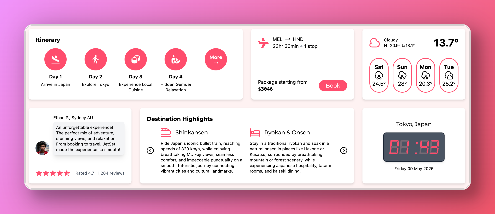
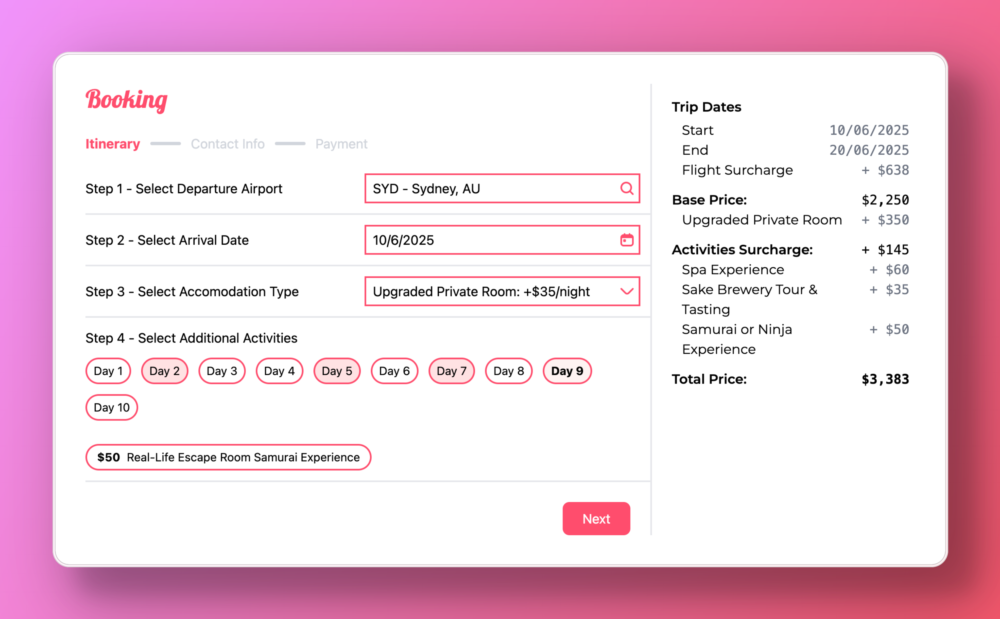

<h1 align="center">🗺️ JetSet - Tour Agency 🗺️</h1>

<p align="center">
  
  
  
</p>

---

## 📌 Overview
I created this tour booking website out of a love for travel and as a goal to sharpen my front-end skills. Particularly, I wanted to improve my design skills and learn more about the implementation of microinteractions within front-end functionality. 

Additionally, I also set this project as a goal to learn the basics of Tailwind CSS as this is the first time I have used it in a full project.

I also wanted to build something fully customizable, so instead of hard-coding static pages, all content is dynamically generated from a single .json file. This approach makes the site easy to scale and maintain while keeping the structure clean and consistent.

## 🚀 Live Demo
[Click here to view the live project](jakobternel.github.io/tour-agency/)

## ✨ Features
- Parallax hero scrolling effect when viewed on desktop
- Connections to live data including IP geolocation, weather data and flight price estimation
- Automatically calculates flight price 6 months in the future from user's closest airport
- Tour data held entirely within a .json file for easy customisation and expansion
- Dynamic map generation based on .json information

## 📸 Screenshots

<p align="center">
  
</p>
<p align="center">
  
</p>
<p align="center">
  
</p>
<p align="center">
  
</p>

## 📂 Installation
To run this project locally:

```bash
git clone https://github.com/jakobternel/tour-agency.git
cd tour-agency
npm install
npm run start
```

To learn more about customising the data, please view the [documentation](jakobternel.github.io/tour-agency/) on tour data inputs